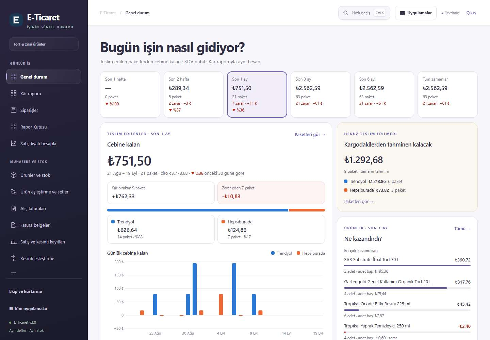
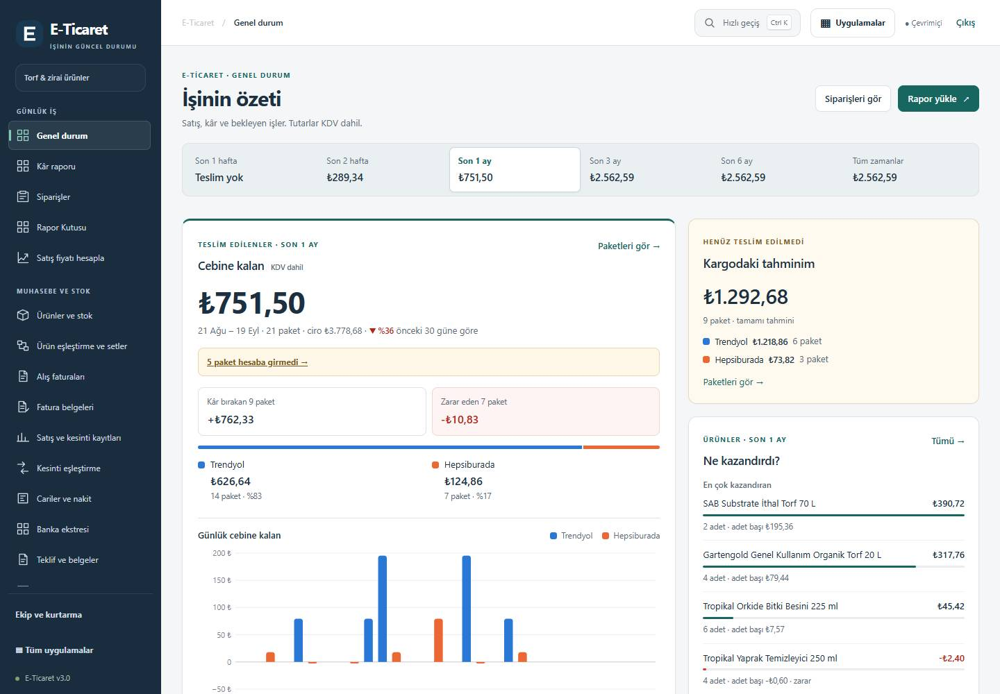
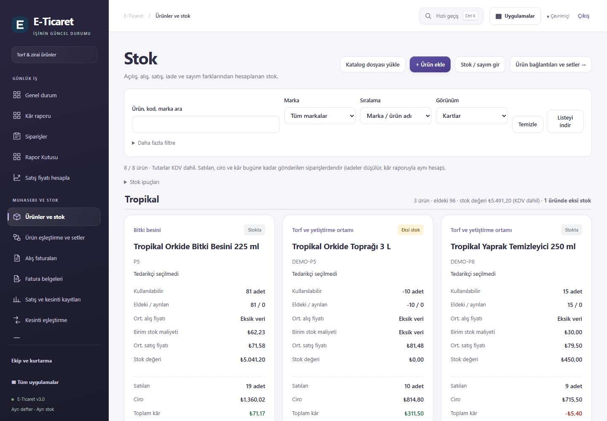
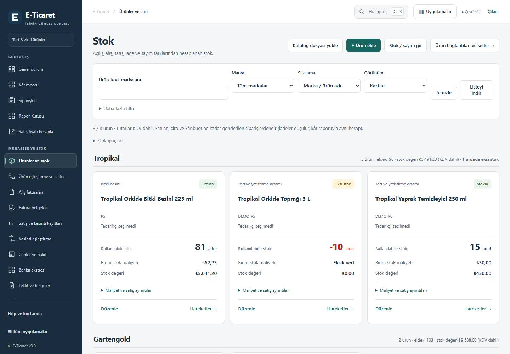
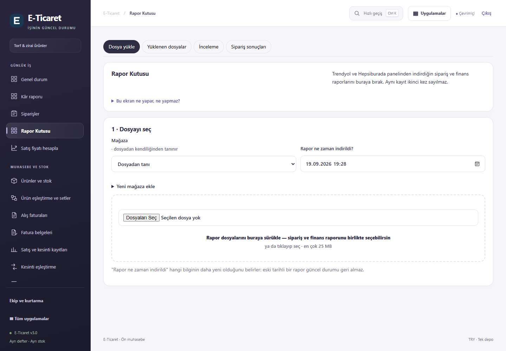
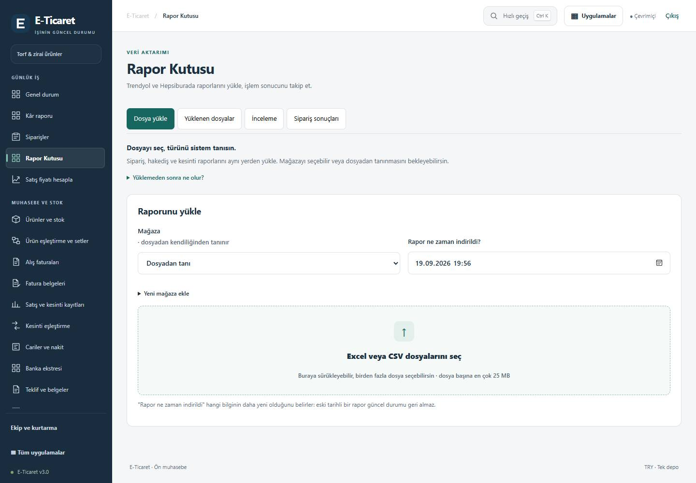

# Lunapot — Tasarım ve Kullanılabilirlik İncelemesi
19 Eylül 2026 · E-ticaret çalışma alanı · Claude'a uygulama devri

**Durum:** Aşağıdaki arayüz düzenlemeleri yerel projede uygulandı. Canlıya yayınlanmadı. Finansal motorun sorunları [ana sorun–çözüm raporunda](CODEX-SORUN-COZUM-RAPORU-2026-09-19.md); bu tasarım çalışması o sorunları kapatmaz.

**Kullanıcının hedefi:** KDV dahil rakamları anlaşılır biçimde görmek; markalara göre stoğu takip etmek; sipariş penceresinde satılan ürünü tanımak; TY/HB raporlarını tür seçme zorunluluğu olmadan yüklemek; tekrar tekrar teknik yardım gerektirmeyen bir iş akışı.

## 1. İnceleme yöntemi ve sınırlar

Aktif proje Desktop/site/lunapot-panel; temel sürüm d44924e. İnceleme, gerçek ekran modülleri ve test veritabanı kullanan yerel önizlemede yapıldı. 17 ana ekran masaüstünde, beş yoğun kullanılan ekran telefonda açıldı. Sipariş ve stok hareketleri pencereleri ayrıca denendi.

Ekran görüntülerindeki ürünler, siparişler, stoklar ve tutarlar **örnek veridir**. Gerçek işletme kârı veya gerçek stok olarak okunmamalı. Fiyat hesabının gecikme testinde sunucu yanıtları kontrollü örneklerle değiştirildi; bu kontrol finansal formül doğrulaması değildir. Hiçbir canlı satış, fatura, stok veya müşteri kaydı değiştirilmedi.

Önizleme ölçüleri: masaüstü 1440 × 1000; telefon 390 × 844. Yerel Edge/Chromium kullanıldı. İki genişlikte kontrol yapılması bütün cihazlarda kusursuzluk iddiası değildir. Gerçek hesapla tüm yazma işlemleri, tüm hata çeşitleri ve tüm erişilebilirlik standartları uçtan uca denetlenmedi.

## 2. Tasarımda ne yanlıştı, nasıl çözüldü?

| No | Sorun ve kullanıcı etkisi | Uygulanan çözüm | Kaynak |
|---|---|---|---|
| UI01 | Sayfa başlıkları çok büyük, kartlar birbirine benzer ağırlıkta, mor vurgular her yerde. Kullanıcı önce neye bakacağını seçmek zorunda kalıyor. | Koyu lacivert menü, sakin gri zemin, yeşil ana eylem, tutarlı yazı ve aralık sistemi. Ekran başlıkları ve formlar ortak ritme alındı. | [commerce-design.css](../public/commerce-design.css), [ecommerce.html:1](../public/ecommerce.html#L1) |
| UI02 | Ana sayfadaki altı dönem kartı tutar, paket, zarar ve değişimi aynı anda tekrar ediyor. | Dönemler kompakt bir seçicide; dönem adı ve tutar korunuyor, ayrıntı seçili dönemde gösteriliyor. Dönem adresi ve yenileme davranışı korundu. | [panorama-ui.js:51](../public/panorama-ui.js#L51) |
| UI03 | Eksik paket ve tahmin notu büyük toplamın altında, grafikten sonra kalıyordu. Toplam kesinmiş gibi okunabiliyordu. | Tahmin/eksik veri uyarıları büyük toplamın hemen altına taşındı. KDV dahil etiketi toplamın yanında; KDV hariç katkı ayrı açıklama bölümünde. | [panorama-ui.js:68](../public/panorama-ui.js#L68) |
| UI04 | Ana sayfada sık yapılan rapor yükleme işi birçok kart arasında kayboluyor. | Başlığa görünür Rapor yükle ve Siparişleri gör eylemleri eklendi. İş listesi daha sakin satırlara dönüştü. | [operations-ui.js:34](../public/operations-ui.js#L34) |
| UI05 | Stok kartlarında bütün maliyet ve satış metrikleri açık; eldeki malı görmek için uzun sayfa gerekiyor. | Marka grupları korunuyor. Kullanılabilir miktar büyük; birim maliyet ve stok değeri açık. Satış, ciro, ortalama fiyat ve kâr ayrıntıları açılır bölümde korunuyor. Eksi stok miktarı renk ve metinle ayrılıyor. | [product-list.js:58](../public/product-list.js#L58) |
| UI06 | Stok tablosu 13 sütuna çıkıyor, birçok ekranda çok uzun etiket-değer listelerine dönüşüyor. | E-ticaret tablosu altı temel sütuna indirildi: ürün/tedarikçi, kullanılabilir miktar, birim maliyet, stok değeri, ayrıntılar, işlemler. Diğer alanlar ayrıntıda mevcut. Sıralama üstteki mevcut seçimden yapılır. | [product-list.js:59](../public/product-list.js#L59) |
| UI07 | Rapor ekranında ana başlık yok; açıklama başlıktan kopuk; ham dosya girdisi tasarımı bozuyor. | Ana başlık, açıklama, ekran düğmeleri ve yükleme alanı sıraya kondu. Geniş sürükle/seç alanı, dosya sınırı ve çoklu seçim açıklaması eklendi. Gerçek dosya girdisi klavye odağını koruyor. | [report-inbox-ui.js:81](../public/report-inbox-ui.js#L81), [report-inbox-ui.js:108](../public/report-inbox-ui.js#L108) |
| UI08 | Rapor yardımında “stok/sevkiyat oluşturmaz” ifadesi mevcut otomatik işleme davranışıyla çelişiyor. | Tür tanıma, bilinen kaydın işlenmesi, belirsizliğin incelemeye ayrılması ve sonucun takip edilmesi anlatılıyor. Kesinleşmemiş kayıt için başarı iddiası yok. | [report-inbox-ui.js:90](../public/report-inbox-ui.js#L90) |
| UI09 | Fiyat tahmini kesin alt fiyat gibi yazılıyor; adet/ölçü farkının etkisi anlaşılmıyor. | Sonuçlar tahmin olarak adlandırıldı. Geçmiş kesinti, paket ölçüsü ve güncel tarife farkı açıklanıyor. Bu metin değişikliği kargo modelindeki hesap hatasını çözmez. | [fiyat-hesap-ui.js:11](../public/fiyat-hesap-ui.js#L11) |
| UI10 | Ürün temizlendiğinde eski fiyat sonucu kalıyor; eski isteğin hatası veya kapanışı yeni sonucu bozabiliyor. | Boş seçimde sonuç temizleniyor. Girdi değiştiği anda önceki istek geçersizleşiyor; başarı/hata/yüklenme bitişinde de sıra kontrol ediliyor. Geçersiz adetle hesap çalıştırılmıyor. | [fiyat-hesap-ui.js:23](../public/fiyat-hesap-ui.js#L23) |
| UI11 | Ortak ekran iyileştiricisi bütün etkin yüklenme işaretlerini rastgele siliyordu. Ekran okuyucu iş devam ederken bitmiş sanabiliyordu. | Yüklenme durumunu sahibi olan ekran yönetiyor. Ortak dosyadaki koşulsuz temizleme kaldırıldı. | [ui-shell.js:14](../public/ui-shell.js#L14) |
| UI12 | Sipariş satırının adı yalnız “Ürün” ise eşleşmiş gerçek ürün satır başlığında görünmüyor. Eylem kutusu ürünün önüne geçiyor. | Genel/boş satır adı için mevcut stok eşleşmesindeki gerçek ad gösteriliyor; eşleşme yoksa bu açıkça yazılıyor. Paket adı önce, işlem eylemleri sonra geliyor. Miktar ve bileşenler korunuyor. | [orders-ui.js:191](../public/orders-ui.js#L191) |
| UI13 | Siparişin KDV hariç katkısı “vergi sonrası gerçek katkı” diye adlandırılıyor. Gelir vergisi dahilmiş izlenimi doğuyor. | Etiket “KDV hariç katkı” olarak düzeltildi. Hesaplama değiştirilmedi. | [orders-ui.js:205](../public/orders-ui.js#L205) |
| UI14 | Fatura belgeleri ve banka ekranında tutarlı ana başlık yok. | Tek h1 ve ortak sayfa başlığı düzeni uygulandı. | [sales-document-ui.js:314](../public/sales-document-ui.js#L314), [bank-ui.js:126](../public/bank-ui.js#L126) |

## 3. Önce / sonra

Görüntüler örnek verili yerel önizlemedendir.

### Ana sayfa

Önce:

Sonra:

### Stok

Önce:

Sonra:

### Rapor yükleme

Önce:

Sonra:

[Telefon ana sayfa](tasarim-inceleme-2026-09-19/telefon-ana-sayfa.jpg) · [Telefon sipariş penceresi](tasarim-inceleme-2026-09-19/telefon-siparis.jpg) · [Sipariş penceresi](tasarim-inceleme-2026-09-19/siparis-penceresi.jpg) · [Stok tablosu](tasarim-inceleme-2026-09-19/stok-tablosu.jpg)

## 4. Ekranların tamamı için değerlendirme

| Ekran | Bu çalışmada yapılan / doğrulanan | Claude'un sonraki işinde koruyacağı veya tamamlayacağı nokta |
|---|---|---|
| Genel durum | Dönem, ana toplam, tahmin ve eksik hesap hiyerarşisi yenilendi. | İade kapsamı ve çok kayıt sınırı backend raporundaki gibi çözülmeden toplamın tamlığı varsayılmamalı. |
| Kâr raporu | Ortak form/tablo/başlık stili; ekran açılışı ve taşma kontrolü. | Bilinen, tahmini, hesaplanamayan sonuç aynı finans kaynağından gelmeli. “Kesinleşen” ifadesi yalnız gerçekten doğrulanmış tutarda kullanılmalı. |
| Siparişler ve pencere | Tam ürün adı, adet ve eşleşmeler kontrol edildi. Liste filtresi pencere kapandıktan sonra korunuyor. | Tahmin kaynağı ve para tutarı ana sayfa/kâr raporuyla ortaklaştırılmalı. Listeye sıfır/uydurma maliyet dönmemeli. |
| Rapor Kutusu | Yükleme düzeni, klavye erişimi, sekmeler, yardım açıklaması yenilendi. | Eşzamanlı rapor, kısmi iade ve yarım işlem hataları düzeltilmeli. “Yüklendi / işlendi / incelenecek” ayrı ve gerçek sonuç sayılarıyla gösterilmeli. |
| Satış fiyatı | Form düzeni ve tahmin etiketi; eski yanıt yarışı giderildi. | Adet/ölçü uyumlu kargo örneği, güncel tarife ve ambalaj/diğer giderler gerçek hesaba katılmalı. |
| Ürünler ve stok | Marka grupları, kompakt kart/tablo, tedarikçi ve ayrıntılar. | Sıfır stok ile bilinmeyen maliyet ayrılmalı; TS1 geç gelen fatura maliyeti doğru tamamlanmalı. |
| Ürün eşleştirme ve setler | Ortak görünüm ve açılış kontrolü. | TS1 varyant eşdeğerliği, yaprak temizleyicisiz orkide seti ve tek siparişlik Pina istisnası kalıcı iş kuralı olarak korunmalı. |
| Alış faturaları | Ortak görünüm ve açılış kontrolü. | Bilinen faturanın otomatik kabulü, belirsiz faturanın neden beklediği ve kısmi kabulün devamı açık olmalı. |
| Fatura belgeleri | Ana başlık ve dosya arşivi rolü netleştirildi. | Arşivlenmiş belge ile muhasebeleşmiş/stoğa girmiş belge ayrı durumlar olarak kalmalı. |
| Satış ve kesinti kayıtları | Ortak tablo stili, mevcut ekran açılışı. | Eski net tutar odaklı alanlar, kullanıcıya KDV dahil ana değer + isteğe bağlı teknik ayrıntı düzenine geçirilirken hesap sözleşmesi de incelenmeli. |
| Kesinti eşleştirme | Kart, tablo ve başlık tutarlılığı. | Dağıtılmayan kesinti toplamı ve hangi satışın etkilendiği açık kalmalı; bir belgenin iki kez dağıtılması engellenmeli. |
| Cariler ve nakit | Ortak sekme, tablo ve form stili. | Borç/alacak, tahsilat/ödeme ve kapanış ayrımı korunmalı; hesap dökümü tam veriyle denenmeli. |
| Banka ekstresi | Ana başlık düzeltildi. | “Bankaya yattı” ifadesi yalnız gerçek ekstre eşleşmesinde kullanılmalı. |
| Teklif ve belgeler | Ortak görsel dil ve açılış kontrolü. | Ön muhasebe taslağı ile resmi fatura ayrımı korunmalı. |
| Genel giderler | Ortak görsel dil ve açılış kontrolü. | Satışta zaten bulunan kargo/komisyonun tekrar yazılmasını önleyen açıklama korunmalı. |
| Bağlantılar | Ortak görsel dil ve açılış kontrolü. | Gerçek son başarılı işlem, hata ve aktarım kapsamı gösterilmeli. Etkin olmayan otomasyona çalışıyor denmemeli. |
| Şirket ve yedek | Ortak görsel dil ve açılış kontrolü. | Kullanıcı akışındaki teknik kurtarma komutları ileride ayrı teknik ayrıntıya alınmalı. Geri dönüş penceresi plana bağlı gerçek kaynaktan doğrulanmalı. |

## 5. Tasarım sözleşmesi

- Ana tutarlar KDV dahil; KDV hariç teknik değer açıkça etiketlenmiş ayrıntı olarak kalmalı.
- Bilinmeyen tutar boş/“bilgi bekleniyor”; sıfır yalnız bilinen sıfır. Tahmin etiketle gösterilir. Uyarı yalnız sayfanın en altında bırakılamaz.
- Sayfa başına bir ana başlık; birincil işlem dolu yeşil, ikincil işlem sade. Silme/iptal eylemi normal ilerleme düğmesi gibi görünmemeli.
- Masaüstünde yoğun tablolar okunabilir kalmalı; telefonda yatay kaydırmaya muhtaç kritik iş akışı olmamalı. Tam ürün adı ve adet kısaltılmamalı.
- Marka grupları Tropikal, Gartengold, Klasmann ve varsa diğer markalar. Ayrıntı kapalıyken kullanılabilir stok, birim maliyet ve stok değeri görünür.
- Sadece renk kullanılmaz: eksi stok, eksik eşleşme, tahmin ve iade metinle de belirtilir.
- Dosya seçimi klavye erişimli; menü Escape ile kapanır ve odağı geri verir. Açılır ayrıntılar yerel details/summary davranışını kullanır.
- Paket / RPT kimliği kullanıcının gördüğü ürün adının yerini almaz; ihtiyaç halinde kopyalanabilir kalır.

## 6. Uygulama sınırları ve bakım notları

Yeni görsel kurallar **yalnız e-ticaret sayfasında yüklenen** commerce-design.css içinde, body.commerce ile kapsamlanmıştır. Ortak üretim paneli için eski stok kartı/tablo çıktısı korunur; accounting-ui.js yalnız ec alanında compact seçeneğini açar.

Mevcut style/accounting/design/ui-polish/ui-navigation katmanları topluca kaldırılmadı: bunlar üretim alanı ve birçok diyaloğu da etkiliyor. Bu, eski stillerin tamamen temizlendiği anlamına gelmez. Yeni e-ticaret tasarımının sahibi tek dosyadır; buradan sonra aynı bileşene farklı eski dosyalarda yeni override eklemeyin. Katman sadeleştirmesi ayrı, iki çalışma alanını kapsayan bir görsel regresyon işi olarak yapılmalı.

Service worker önbelleği v107-commerce-design oldu; yeni CSS kabuk listesine eklendi. Bu sürüm adı tek başına canlıya çıkıldığı anlamına gelmez. Sunucu formülleri ve veritabanı migration'ları bu UI değişiklik setinde değiştirilmedi.

## 7. Doğrulama ve kabul

- Mevcut testlerin tamamı: **552 geçti, 0 hata**. Bu yeşil sonuç, ana rapordaki eksik senaryoların düzeldiğini göstermez.
- Yayın yapmayan derleme kontrolü başarılı: Wrangler dry run.
- 17 ana ekran masaüstünde açıldı; JavaScript hatası veya belge genişliğini aşan yatay taşma gözlenmedi.
- Telefon kontrolü: genel durum, stok, siparişler, rapor yükleme, fiyat hesabı; ek olarak sipariş penceresi.
- Etkileşim kontrolleri: dönem seçimi/yenileme, marka filtresi, kart ayrıntısı, altı sütunlu tablo, stok hareketleri, sipariş penceresi ve filtreye dönüş, mobil menü Escape/odak, rapor düğmeleri, dosya seçici odağı.
- Tarayıcı etkileşim kontrol kaydı: [23 kontrol](tasarim-inceleme-2026-09-19/tarayici-kontrolleri.json). Ek kısa bekleme testinde 250 ms dolmadan, 87 ms içinde eski yanıtın görünmediği doğrulandı.
- Gecikmeli fiyat yanıtı: eski hata yeni sonucu ezmiyor; boş ürün önceki hesabı temizliyor; devam eden isteğin yanıtı boş seçime geri yazılmıyor; yüklenme durumu işlem sürerken korunuyor.
- Kaynak biçim kontrolünde hata yok. Finansal kayıt yazan gerçek kullanıcı akışlarının canlı uçtan uca testi bu çalışmanın kapsamında yapılmadı.

## 8. Claude'a teslim

1. Ana sorun–çözüm raporunu ve bu raporu birlikte oku. Önce veri doğruluğu ve yeniden deneme/eşzamanlılık sorunlarını çöz.
2. Yerel UI değişikliklerini mevcut çalışma ağacında incele; bunları silerek eski tasarıma dönme. Mevcut kullanıcı değişikliklerini topluca sıfırlama.
3. Finansal hesapları birleştirirken ana sayfa, ürün kârı, sipariş listesi/penceresi ve fiyat tahmininin veri sözleşmelerini birlikte ele al. UI'da rakamı güzel göstermek, arka plandaki sıfır maliyet veya eksik iadeyi düzeltmez.
4. Her finansal düzeltmenin eski hatayı üreten testini ekle. Geçmiş kayıt onarımını önce salt okunur fark listesiyle hazırla; keyfi stok girişi veya doğrudan geçmişi silerek düzeltme yapma.
5. Canlıya çıkmadan temel ekranları gerçek veriyle salt okunur kontrol et; gerekirse migration sırasını hazırla. Bu raporlar ve yerel UI değişiklikleri henüz commit/push/deploy edilmedi.
